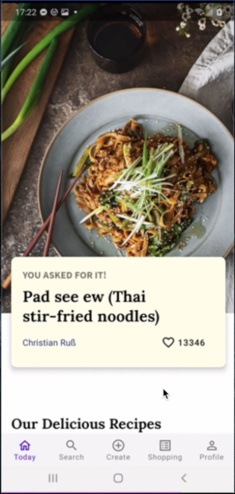
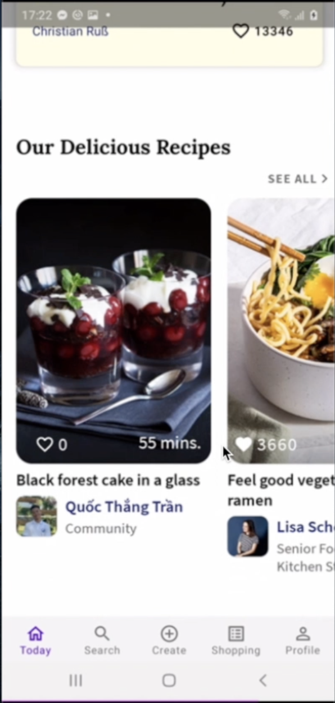
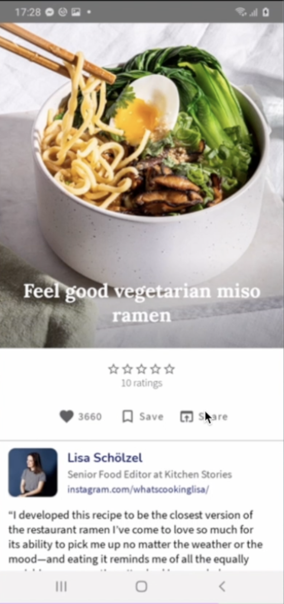
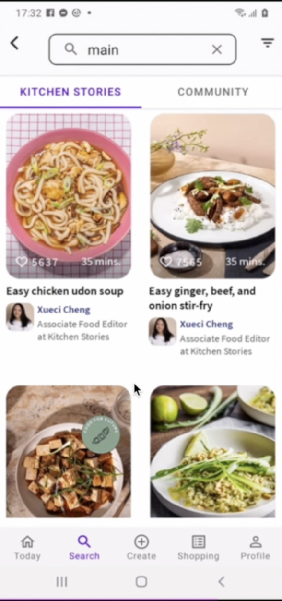
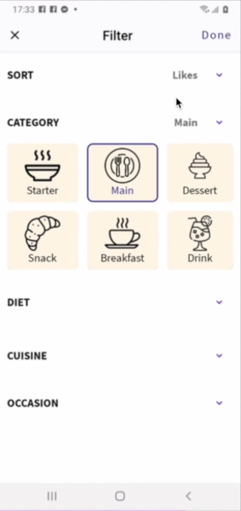
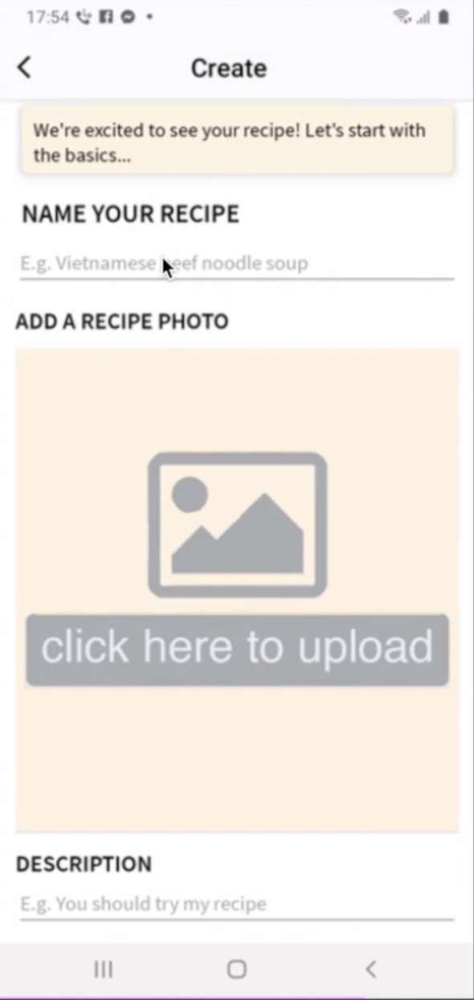
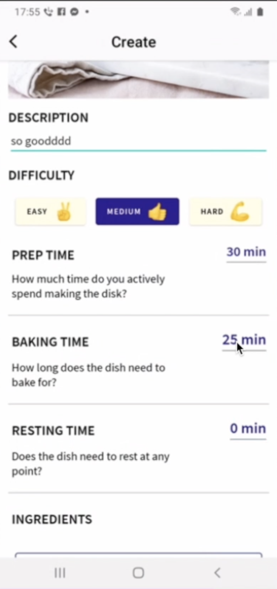
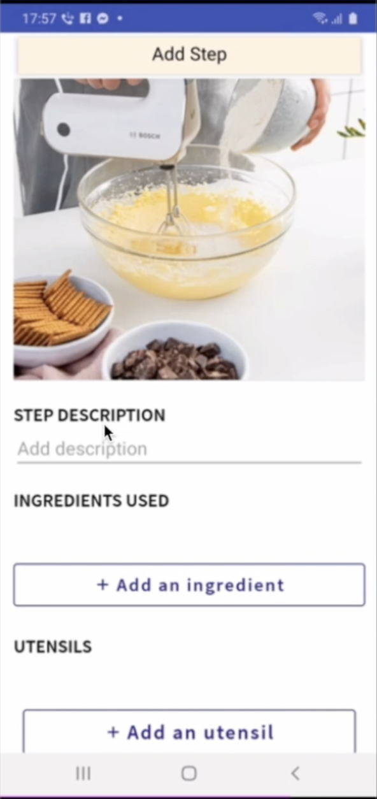
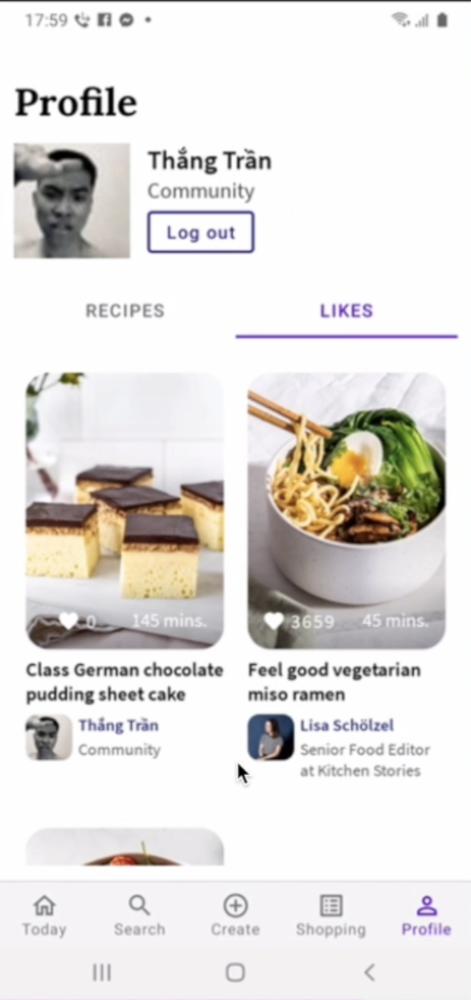

# Kitchen Stories

## Table of Contents
* [Introduction](#introduction)
* [Video Demo](#video-demo)
* [Technologies Used](#technologies-used)
* [Features](#features)
* [How to install and run the project](#how-to-install-and-run-the-project)
* [Acknowledgements](#acknowledgements)
* [Development Team](#development-team)
* [License](#license)

<!-- * [License](#license) -->

## Introduction
- **Kitchen Stories** is an application for finding and sharing recipes as a community of cooking lovers. With this application, users can post recipes with illustrations and save their favorite recipes.   
- **Kitchen Stories** also supports a feature that allows users to share recipes on social networking sites.   
- With **Kitchen Stories**, users can easily master cooking tricks, conquer the most difficult recipes and discover the culinary styles of many regions around the world.   

This is the [Software Requirements Document](https://docs.google.com/document/d/1bj_LPkkpx9Cc0hroui2W9OegKTkgXD3O/edit?usp=sharing&ouid=116992013396456829835&rtpof=true&sd=true)

  

 

## Video Demo
You can have a look with Kitchen Stories through [the video](https://drive.google.com/file/d/1MEkqB1fEgzFvtbOeYVhkS72-84l2ZnS-/view?usp=sharing).

## Technologies Used
**Kitchen Stories** should use the following technologies, frameworks and development techniques:

- [Android SDK](https://docs.microsoft.com/vi-vn/dotnet/desktop/winforms/?view=netframeworkdesktop-4.8) 
- [Firebase](https://firebase.google.com/) 
- [Sqlite](https://developer.android.com/jetpack/androidx/releases/sqlite?gclid=Cj0KCQjwmuiTBhDoARIsAPiv6L8otpyiTPaQvU8mjXeeLmlOSjtNf_CXDAlM8cenq28ZBxOXFfTIVoIaAlirEALw_wcB&gclsrc=aw.ds) 
- [Material design - Component libraries](https://material.io/design) 
- [Facebook SDK](https://developers.facebook.com/docs/facebook-login/) 

## Features
A few of the things you can do with **Kitchen Stories**:
- Log in
- List of recipes
- Recipe details
- Like recipe
- Show profile
- Show liked recipe
- Show created recipe
- Show recipes in shopping list
- Search recipes allow to ingredients in filter
- Comment in post realtime
- Create recipe 

 
  

 

## How to install and run the project
To clone and run this application, you'll need [Android Studio](https://developer.android.com/studio) installed on your computer.  
`Run project` in Android Studio

## Acknowledgements
- Thanks to [Android](https://www.android.com/) for supporting us with Android development documentation
- Thanks to [Stackoverflow](https://stackoverflow.com/) for supporting us 
- Thanks to [Github](https://github.com/) for supporting us control application's versions
- Thanks to [Firebase](https://firebase.google.com/) for supporting us to control database service
- Thanks to [Material design - Component libraries](https://material.io/design) for supporting us to build UIcomponent
- Thanks to [Facebook Developer](https://developers.facebook.com/) for supporting us to build Log in feature with Facebook

## Development Team
- [Tran Quoc Thang](https://github.com/LucasTran-tq)
- [Nguyen Huu Phat](https://github.com/nguyenhuuphat2001)
- [Truong Xuan Tam](https://github.com/11012001)

## 📝 License
Copyright © 2021.  

